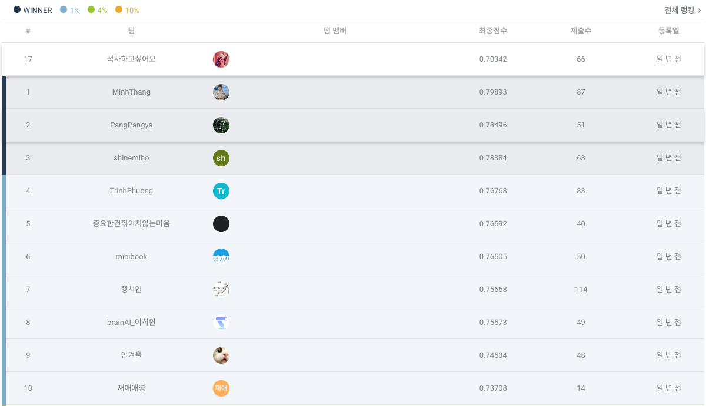

# 도배 하자 유형 분류 AI 경진대회

## 주제

도배 하자의 유형 분류 AI 모델 개발

## 데이터 예시

 

### __Class Histogram__

## 목표

- 실험 파이프라인을 잘 구성하여 하루에 1번은 꼭 제출(실패...)
- 깨끗한 코드
- 논리적인 실험 설계

## 접근 방법
클래스의 불균형이 매우 심한 데이터, Longtail problem의 범주를 넘어선 불균형
- Data Augmentation
    - [SinGAN](https://arxiv.org/abs/1905.01164)  
    3장 밖에 없는 데이터를 어떻게 Augmentation 할 수 있을까 고민하다 SinGAN을 사용해 Augmentation 진행  
    몇몇 class는 피쳐들이 소실됨(녹오염 이미지 같은 경우), 소실되는 class는 제외하고 Augmentation 
    

    - torchvision.transforms  
    wandb sweep으로 최적화된 확률값의 Augmentation 적용
        - RandomHorizontalFlip
        - RandomRotation
        - RandomInvert
        - ColorJitter_brightness
        - ColorJitter_hue
        - RandomAutocontrast
        - RandomAdjustSharpness
        - RandomGrayscale

- Loss
    - [ASL](https://arxiv.org/abs/2009.14119)  
    Multi label Task 에서 Data imbalance를 해결하기 위해 자주 사용한다고 한다고 하는데 focal loss 보다 좋은 성능을 보인다고함  
    실재 적용시 평균적으로 0.1 정도의 성능 향상의 효과를 볼 수 있었음  

- Pipeline  
    - huggingface의 datasets, transformers 라이브러리로 모델 학습 파이프라인구성
    - wandb로 실험 tracking 

## 결과

| Accuracy       | 
| ------------ | 
| 14등 (0.71425) | 

## 총평 및 느낀점
- 정석적인 방법으로 Longtail problem 해결하기 싫어서 Segmentation Anything을 이용해 이미지를 합성등, 여러가지 방법을 많이 사용했지만 결국엔 유의미한 Augmentation은 SinGAN 밖에 없었다. 잘모르는 Task는 정석적인 방법을 이용하도록 하자, 한 문제에 매몰 되지말자 
- 실험 파이프라인을 그래도 잘 만들어놔서 뿌듯하다
- 공부 열심히 하자. 기초를 튼튼히 하는 것보다 좋은 성능 향상 방법은 없다.
- 굳이 classifier 문제로 해결하지 않아도 될듯하다. detection, segmentation등으로 task를 세분화 해서 해결 하는 방법도 괜찮을듯한데 ..