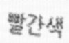

# 2023 교원그룹 AI 챌린지 <예선>

## 주제

손글씨 인식 AI 모델 개발

## 데이터 예시

 

&nbsp;&nbsp;&nbsp;&nbsp;&nbsp;&nbsp;&nbsp;&nbsp;&nbsp;&nbsp; &nbsp;&nbsp;&nbsp;&nbsp;&nbsp;&nbsp;&nbsp;&nbsp;&nbsp;&nbsp; &nbsp;&nbsp;&nbsp;&nbsp;&nbsp;&nbsp;&nbsp;&nbsp;&nbsp;&nbsp;

## 목표

- OCR Task 공부 
- 실험 파이프라인을 잘 구성하여 하루에 1번은 꼭 제출(실패...)
- 깨끗한 코드(실패...)

## 접근 방법
- Text Recognition Task 논문만 읽다가 대회 끝날것 같아서 ABINET model 사용
    - Transformer 기반의 multi-modal(vision, language) 모델 
- EDA로 차근차근 해결하기 
    - Vision : Noise, Roate, Pattern
    - language : Text length
- Data Augmentation 으로만 높은 성능을 만들수 있다고 생각해 다양한 방법으로 데이터를 생성해서 학습

## 결과

| Accuracy       | 
| ------------ | 
| 30등 (0.86402) | 

- OCR 공부 + 실험 파이프라인 만든다고 시간을 너무 많이 소모 해버렸다.
- 데이터가 불균형 했기 때문에 모델 구조, 데이터를 어떻게 넣느냐 보다는 어떻게 부족한 데이터를 증강할 수 있을지를 고민하고 실험하는것에 중점을 두었다.

## 총평 및 느낀점
- 언제 일등 해보나..
- 실험 파이프라인을 정말 잘 구성하는게 중요하다..
- 공부 열심히 하자. 기초를 튼튼히 하는 것보다 좋은 성능 향상 방법은 없다.
