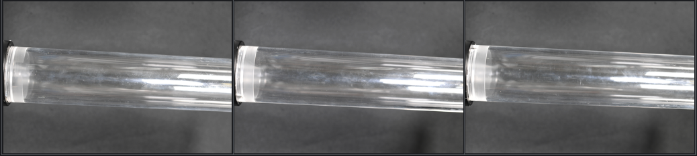

# Image Matching Challenge 2024 - Hexathlon

## 주제

The objective of this contest is to create detailed 3D maps from collections of images captured in a variety of contexts and settings. Participants are tasked with crafting a model capable of producing precise spatial depictions, irrespective of the origin of the images—be they aerial photos from drones, shots within thick woodlands, scenes from the dark of night, or any of the six distinct problem types.

## 데이터 예시

 

 

## 목표

- SfM, 3D Reconstruct 이해
- 깨끗한 코드
- 논리적인 실험 설계

## 접근 방법
 
전체 파이프라인은 위의 이미지와 같이 구성했다  
Roation Detection, Image Pair, KeyPoint Extraction, KeyPoint Matching 순이다.  
아키텍처나 CORE 알고리즘을 개발하기보단 이전 대회의 알고리즘을 base로 기반하고 transparent scene의 인식률이 이번 대회의 핵심이라고 생각하여 transparent scene 데이터를 중심으로 접근했다.
- Dataset
    - Transparent scene  
     투명 이미지의 인식률을 높히기 위해 Edge Enhancement 기법(Laplacian Filter, Canny), 원본 이미지에서 Edge의 Channel 값에 가중치를 입력해 이미지를 합성하는 형식등.. 여러가지 방법을 사용했지만 미미한 정도의 개선이거나 인식률이 떨어저 좋은 결과를 얻지 못했다. 
    - Dark images of the pond, lizard class  
    어두운 이미지를 처리하기 위해서 CLAHE 사용해서 이미지 보정을 했지만 좋은 결과를 얻지 못했다.

- end-to-end matching models  
    - dusr3R  
    ??
    - Omniglue  
    end-to-end matching model에 기대가 커서 Omniglue를 구현했는데 추론시간의 제약때문에 제출하지 못했다.

## 결과

| Accuracy       | 
| ------------ | 
| 146등 (0.153885) | 

## 총평 및 느낀점
- 1위 솔루션이 Transparent Scene을 중점적으로 공략해서 성과를 거둔 만큼 방향성은 맞았지만, 학교와 회사일이 바빠서 많은 시도를 못한것 같아서 아쉽다.
- 남들이 안하는 시도를 많이 해보았지만 남들이 안하는덴 이유가 다 있고 유구한 대회 역사를 가진 대회에서 뉴비가 살아남기란 너무 어려운것 같다.
- Omniglue 열심히 구현했는데 추론시간 초과라니..